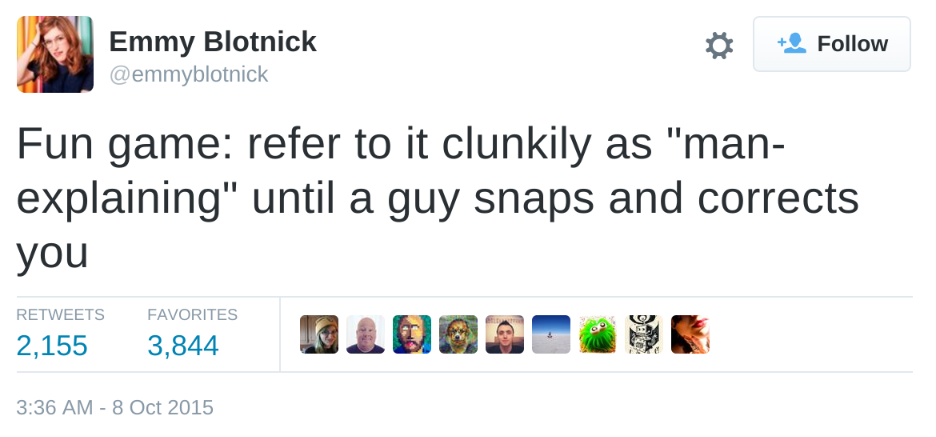

# mansplain
> convert npm man links to html anchor elements

[](https://travis-ci.org/ashleygwilliams/mansplain)
[](https://codeclimate.com/github/ashleygwilliams/mansplain)
[](https://badge.fury.io/js/mansplain)

a tool for converting man-style links to clickable html anchor elements.
made p specifically for the [npm cli reference](http://docs.npmjs.com)



## installation

```bash
npm install mansplain
```

## usage

#### default usage:

```javascript
const mansplain = require('mansplain');

var input = "<li>npm-cmd(9)</li>";
var result = mansplain({ input: input });
console.log(result);

//=> '<li><a href="cmd">cmd</a></li>'
```

#### opts:

`mansplain` can take 3 arguments:
- `input`: a string to be converted
- `skip`: a boolean, if set to `true`, `mansplain` will skip the first match, e.g.:

    ```javascript
    var input = '<li>npm-cmd(9)</li><li>npm-install(1)</li>'
    var result = mansplain({ input: input, skip: true});
    console.log(result);    

    //=> '<li>npm-cmd</li><li><a href="install">npm-install</a></li>'

    ```

- `prefix`: a hash, serves as a prefix for href value. 
  ** DO NOT INCLUDE A TRAILING OR LEADING SLASH **

    ```javascript
    var input = "<li>npm-cmd(1)</li>";
    var result = mansplain({ input: input, prefix: { 1:'cli'}});
    console.log(result);

    //=> '<li><a href="cli/cmd">cmd</a></li>'
    ```

## testing

this package uses mocha framework and the chai assertion library for testing.

```
npm test
```

## notes

- matches on a word with digits, hypens, or periods followed by (n), where n is a single digit
- will remove `npm-` prefix
